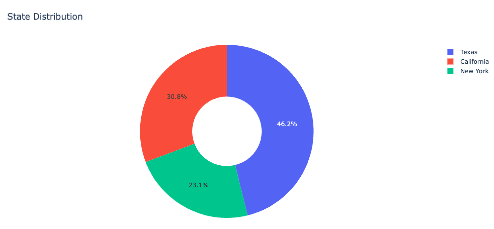

# About

Plotly is a modern plotting library that enables interactive, web-based visualizations. It can produce plots that are not only visually appealing but also interactive, making them ideal for dashboards and data analysis applications. It can be more complex to set up compared to other plotting libraries.

- Strengths:
  - Creates interactive plots that can be embedded in web applications.
  - Offers a wide range of chart types, including 3D plots.
  - Can be easily used with Dash to create web applications.

- Weaknesses:
  - Can be more complex to setup for basic plots.
  - May have a steeper learning curve for new users.

# Types of Plotly charts

Charts can be created in Plotly using two main methods: `plotly.express` and `plotly.graph_objs`. Each method has its own set of features and uses, catering to different levels of customization and complexity.

## Plotly Express (plotly.express)

Plotly Express is a high-level interface for creating simple and concise visualizations. It is designed to be user-friendly and to generate plots quickly with minimal code.

Key Features:

	•	Ease of Use: Requires less code and is easier for quick visualizations.
	•	Automatic Handling: Automatically handles many aspects of the plot, such as color scales, legends, and titles.
	•	Built-in Data Handling: Can directly use DataFrames and column names for data representation.
	•	Less Customization: Limited in terms of deep customization compared to plotly.graph_objs.

```python
import plotly.express as px

df = px.data.tips()
fig = px.pie(df, values='total_bill', names='day', title='Total Bill per Day')
fig.show()
```

This will create a pie chart with total_bill values from the tips dataset, divided by the day column.

## Plotly Graph Objects (plotly.graph_objs or plotly.graph_objects)

Plotly Graph Objects provides a low-level, object-oriented interface for Plotly charts. This method offers more detailed control over the chart’s appearance and behavior.

Key Features:

	•	Detailed Customization: Allows for fine-grained control over almost every aspect of the chart.
	•	Complex Visualizations: Capable of creating more complex and customized visualizations.
	•	Explicit Data Handling: Requires more explicit definitions of data and layout, which can be more verbose but allows for greater control.

Example:

```python
import plotly.graph_objs as go

fig = go.Figure(go.Pie(
    labels=["Apples", "Oranges", "Bananas"],
    values=[4500, 2500, 1050],
    textinfo='label+percent',
    insidetextorientation='radial'
))
fig.update_layout(title_text='Fruit Distribution')
fig.show()
```

## Plotly Chart Studio and Plotly Python API

Besides plotly.express and plotly.graph_objs, Plotly also offers:

	•	Chart Studio: An online platform provided by Plotly where users can create, edit, and share Plotly graphs. It allows for collaborative editing and provides a GUI for creating charts without writing code.
	•	Plotly Python API: You can also use Plotly’s REST API to create and manage charts on the Plotly cloud or on your own server. This is more advanced and typically involves using the Chart Studio for managing the plots.

## Summary

	•	Plotly Express: Best for quick, simple plots with less code. Great for data exploration and basic visualization needs.
	•	Plotly Graph Objects: Offers detailed customization and control over the plot’s appearance and behavior. Suitable for production-quality visualizations and complex charting requirements.
	•	Chart Studio & Plotly API: Additional tools for creating and managing plots, especially useful for sharing and collaborative work.

Professional data analysts usually use both Plotly Express and Plotly Graph Objects. 


# Plotly plots a pie chart

```python
import plotly.express as px

fig = px.pie(
  values=biology.values,
  title='Percentage of Male Vs Female Winners',
  names=biology.index,
  hole=0.4
)

fig.update_traces(textposition='inside', textfont_size=12, textinfo='percent+value')

fig.show()
```

**Explanation**
When we print out `biology = df_data.sex.value_counts()`, this is the output:
```plaintext
sex
Male      876
Female     58
Name: count, dtype: int64
```

The `values` param requires a `list` of values (either a `Pandas Series` or a `Numpy Array`). Hence we set: `values=biology.values`.

`title` set the displayed title of the plot.

`name` set the displayed name of the plot (in other words, the `legend`).

`hole` set the size of the hole in the center of the plot.

## Map data values

```python
data = {
    'state': ['CA', 'NY', 'TX', 'CA', 'TX', 'NY', 'TX', 'CA'],
    'count': [1, 2, 3, 2, 1, 1, 2, 1]
}

df = pd.DataFrame(data)

state_counts = df.groupby('state')['count'].sum()
print(state_counts)
```

Output:

```plaintext

data = {
    'state': ['CA', 'NY', 'TX', 'CA', 'TX', 'NY', 'TX', 'CA'],
    'count': [1, 2, 3, 2, 1, 1, 2, 1]
}

df = pd.DataFrame(data)

state_counts = df.groupby('state')['count'].sum()
print(state_counts)


state
CA    4
NY    3
TX    6
Name: count, dtype: int64
```

Plot the data as a pie chart using Plotly:

```python
import plotly.express as px

fig = px.pie(
  values = state_counts.values,
  names = state_counts.index
)

fig.show()
```

When we hover over the created pie chart, the labels are displayed as 'CA', 'NY', 'TX'. 

How do we make it show the full state names: 'California', 'New York', 'Texas' instead?

To do that, we use the `mapping method`.

First we create an dictionary mapping the abbreviations to full state names:

```python
state_names = {
  'CA': 'California',
  'NY': 'New York',
  'TX': 'Texas'
}
```

Then we create a new column for the `df` dataframe by mapping the `state` column to the `state_names` dictionary:

```python
df['full_state'] = df.state.map(state_names)  # this creates a new column called 'full_state' in the dataframe
print(df)
```

Output:

```plaintext
  state  count  full_state
0    CA      1  California
1    NY      2    New York
2    TX      3       Texas
3    CA      2  California
4    TX      1       Texas
5    NY      1    New York
6    TX      2       Texas
7    CA      1  California
```

Now we can use the `full_state` column to create the same pie chart as before:

```python
full_state_counts = df.groupby('full_state')['count'].sum()

fig = px.pie(
  values = full_state_counts.values,
  names = full_state_counts.index,
  title = 'State Distribution',
  hole = 0.4
)

fig.show()
```

When hoving over the pie chart, the labels now are displayed as 'California', 'New York', 'Texas', so does the chart's legend.


## `update_traces`

This is the default plot (without update_traces):


### Parameters in `update_traces`:

#### `textposition`
The position of the data labels relative to the data points. See the [documentation](https://plotly.com/python/text-and-annotations/#textposition) for more details.

Values of the `textposition` parameter:
- inside
- outside
- auto
- none

#### `textfont`
It is used to customize the appearance of text elements within a plot, such as labels, annotations, or data point labels. We can define the font family, size, color, and more, ensuring that text is displayed clearly and in a style that matches our visualization’s aesthetic.

**Attributes**:
- family
	•	Description: Specifies the font family to be used for the text. It supports standard font names as well as generic family names (e.g., ‘sans-serif’, ‘serif’).
	•	Usage: Can include a single font name or a list of fallback fonts separated by commas.
	•	Example: 'Arial', 'Courier New, monospace', 'Times New Roman, Times, serif'

- size
	•	Description: Sets the font size of the text in points.
	•	Usage: Specify a numeric value indicating the size.
	•	Example: 12, 14

- color
	•	Description: Defines the color of the text. It can be set using color names, hexadecimal color codes, or RGB(A) values.
	•	Usage: Supports various color formats.
	•	Example: 'black', '#ff5733', 'rgb(255, 87, 51)', 'rgba(255, 87, 51, 0.6)'

- colorscale (applicable in certain contexts like heatmaps or other special cases)
	•	Description: Specifies a colorscale for the text, allowing dynamic color adjustments based on data values.
	•	Usage: Typically used in conjunction with specific data visualizations that support colorscales.
	•	Example: 'Viridis', [[0, 'blue'], [1, 'red']]

- coloraxis (advanced usage)
	•	Description: Associates the text color with a color axis, useful when multiple data traces need to share the same color scale.
	•	Usage: Requires setting up a color axis in the layout.
	•	Example: 'coloraxis', 'coloraxis2'

```python
# Customizing text font
fig.update_traces(textfont=dict(
    family='Calibri, sans-serif',
    size=14,
    color='white'
))
```

#### `textinfo`
Determines which trace information appear on the graph.

The 'textinfo' property is a flaglist and may be specified as a string containing:
- Any combination of ['label', 'text', 'value', 'percent'] joined with '+' characters (e.g. 'label+text')
- exactly one of ['none'] (e.g. 'none').

```python
fig.update_traces(textinfo='percent+value')
```

